<html xmlns:v="urn:schemas-microsoft-com:vml"
xmlns:o="urn:schemas-microsoft-com:office:office"
xmlns:w="urn:schemas-microsoft-com:office:word"
xmlns:dt="uuid:C2F41010-65B3-11d1-A29F-00AA00C14882"
xmlns:m="http://schemas.microsoft.com/office/2004/12/omml"
xmlns="http://www.w3.org/TR/REC-html40">

<head>
<meta http-equiv=Content-Type content="text/html; charset=windows-1252">
<meta name=ProgId content=Word.Document>
<meta name=Generator content="Microsoft Word 15">
<meta name=Originator content="Microsoft Word 15">
<link rel=File-List
href="Wide_Sense_Stationary_and_Time_Series_files/filelist.xml">
<link rel=Edit-Time-Data
href="Wide_Sense_Stationary_and_Time_Series_files/editdata.mso">
<!--[if !mso]>

<![endif]--><!--[if gte mso 9]><xml>
 <o:DocumentProperties>
  <o:Author>dell</o:Author>
  <o:LastAuthor>Salim</o:LastAuthor>
  <o:Revision>2</o:Revision>
  <o:TotalTime>1574</o:TotalTime>
  <o:Created>2024-11-22T09:52:00Z</o:Created>
  <o:LastSaved>2024-11-22T09:52:00Z</o:LastSaved>
  <o:Pages>1</o:Pages>
  <o:Words>1681</o:Words>
  <o:Characters>9587</o:Characters>
  <o:Lines>79</o:Lines>
  <o:Paragraphs>22</o:Paragraphs>
  <o:CharactersWithSpaces>11246</o:CharactersWithSpaces>
  <o:Version>15.00</o:Version>
 </o:DocumentProperties>
 <o:CustomDocumentProperties>
  <o:GrammarlyDocumentId dt:dt="string">59780e086a6dce9276b7d7adc0c4c2c568499f949024d3425e572e24ddd8717f</o:GrammarlyDocumentId>
 </o:CustomDocumentProperties>
 <o:OfficeDocumentSettings>
  <o:AllowPNG/>
 </o:OfficeDocumentSettings>
</xml><![endif]-->
<link rel=themeData
href="Wide_Sense_Stationary_and_Time_Series_files/themedata.thmx">
<link rel=colorSchemeMapping
href="Wide_Sense_Stationary_and_Time_Series_files/colorschememapping.xml">
<!--[if gte mso 9]><xml>
 <w:WordDocument>
  <w:TrackMoves>false</w:TrackMoves>
  <w:TrackFormatting/>
  <w:PunctuationKerning/>
  <w:ValidateAgainstSchemas/>
  <w:SaveIfXMLInvalid>false</w:SaveIfXMLInvalid>
  <w:IgnoreMixedContent>false</w:IgnoreMixedContent>
  <w:AlwaysShowPlaceholderText>false</w:AlwaysShowPlaceholderText>
  <w:DoNotPromoteQF/>
  <w:LidThemeOther>EN-US</w:LidThemeOther>
  <w:LidThemeAsian>X-NONE</w:LidThemeAsian>
  <w:LidThemeComplexScript>X-NONE</w:LidThemeComplexScript>
  <w:Compatibility>
   <w:BreakWrappedTables/>
   <w:SnapToGridInCell/>
   <w:WrapTextWithPunct/>
   <w:UseAsianBreakRules/>
   <w:DontGrowAutofit/>
   <w:SplitPgBreakAndParaMark/>
   <w:EnableOpenTypeKerning/>
   <w:DontFlipMirrorIndents/>
   <w:OverrideTableStyleHps/>
  </w:Compatibility>
  <m:mathPr>
   <m:mathFont m:val="Cambria Math"/>
   <m:brkBin m:val="before"/>
   <m:brkBinSub m:val="&#45;-"/>
   <m:smallFrac m:val="off"/>
   <m:dispDef/>
   <m:lMargin m:val="0"/>
   <m:rMargin m:val="0"/>
   <m:defJc m:val="centerGroup"/>
   <m:wrapIndent m:val="1440"/>
   <m:intLim m:val="subSup"/>
   <m:naryLim m:val="undOvr"/>
  </m:mathPr></w:WordDocument>
</xml><![endif]--><!--[if gte mso 9]><xml>
 <w:LatentStyles DefLockedState="false" DefUnhideWhenUsed="false"
  DefSemiHidden="false" DefQFormat="false" DefPriority="99"
  LatentStyleCount="371">
  <w:LsdException Locked="false" Priority="0" QFormat="true" Name="Normal"/>
  <w:LsdException Locked="false" Priority="9" QFormat="true" Name="heading 1"/>
  <w:LsdException Locked="false" Priority="9" SemiHidden="true"
   UnhideWhenUsed="true" QFormat="true" Name="heading 2"/>
  <w:LsdException Locked="false" Priority="9" SemiHidden="true"
   UnhideWhenUsed="true" QFormat="true" Name="heading 3"/>
  <w:LsdException Locked="false" Priority="9" SemiHidden="true"
   UnhideWhenUsed="true" QFormat="true" Name="heading 4"/>
  <w:LsdException Locked="false" Priority="9" SemiHidden="true"
   UnhideWhenUsed="true" QFormat="true" Name="heading 5"/>
  <w:LsdException Locked="false" Priority="9" SemiHidden="true"
   UnhideWhenUsed="true" QFormat="true" Name="heading 6"/>
  <w:LsdException Locked="false" Priority="9" SemiHidden="true"
   UnhideWhenUsed="true" QFormat="true" Name="heading 7"/>
  <w:LsdException Locked="false" Priority="9" SemiHidden="true"
   UnhideWhenUsed="true" QFormat="true" Name="heading 8"/>
  <w:LsdException Locked="false" Priority="9" SemiHidden="true"
   UnhideWhenUsed="true" QFormat="true" Name="heading 9"/>
  <w:LsdException Locked="false" SemiHidden="true" UnhideWhenUsed="true"
   Name="index 1"/>
  <w:LsdException Locked="false" SemiHidden="true" UnhideWhenUsed="true"
   Name="index 2"/>
  <w:LsdException Locked="false" SemiHidden="true" UnhideWhenUsed="true"
   Name="index 3"/>
  <w:LsdException Locked="false" SemiHidden="true" UnhideWhenUsed="true"
   Name="index 4"/>
  <w:LsdException Locked="false" SemiHidden="true" UnhideWhenUsed="true"
   Name="index 5"/>
  <w:LsdException Locked="false" SemiHidden="true" UnhideWhenUsed="true"
   Name="index 6"/>
  <w:LsdException Locked="false" SemiHidden="true" UnhideWhenUsed="true"
   Name="index 7"/>
  <w:LsdException Locked="false" SemiHidden="true" UnhideWhenUsed="true"
   Name="index 8"/>
  <w:LsdException Locked="false" SemiHidden="true" UnhideWhenUsed="true"
   Name="index 9"/>
  <w:LsdException Locked="false" Priority="39" SemiHidden="true"
   UnhideWhenUsed="true" Name="toc 1"/>
  <w:LsdException Locked="false" Priority="39" SemiHidden="true"
   UnhideWhenUsed="true" Name="toc 2"/>
  <w:LsdException Locked="false" Priority="39" SemiHidden="true"
   UnhideWhenUsed="true" Name="toc 3"/>
  <w:LsdException Locked="false" Priority="39" SemiHidden="true"
   UnhideWhenUsed="true" Name="toc 4"/>
  <w:LsdException Locked="false" Priority="39" SemiHidden="true"
   UnhideWhenUsed="true" Name="toc 5"/>
  <w:LsdException Locked="false" Priority="39" SemiHidden="true"
   UnhideWhenUsed="true" Name="toc 6"/>
  <w:LsdException Locked="false" Priority="39" SemiHidden="true"
   UnhideWhenUsed="true" Name="toc 7"/>
  <w:LsdException Locked="false" Priority="39" SemiHidden="true"
   UnhideWhenUsed="true" Name="toc 8"/>
  <w:LsdException Locked="false" Priority="39" SemiHidden="true"
   UnhideWhenUsed="true" Name="toc 9"/>
  <w:LsdException Locked="false" SemiHidden="true" UnhideWhenUsed="true"
   Name="Normal Indent"/>
  <w:LsdException Locked="false" SemiHidden="true" UnhideWhenUsed="true"
   Name="footnote text"/>
  <w:LsdException Locked="false" SemiHidden="true" UnhideWhenUsed="true"
   Name="annotation text"/>
  <w:LsdException Locked="false" SemiHidden="true" UnhideWhenUsed="true"
   Name="header"/>
  <w:LsdException Locked="false" SemiHidden="true" UnhideWhenUsed="true"
   Name="footer"/>
  <w:LsdException Locked="false" SemiHidden="true" UnhideWhenUsed="true"
   Name="index heading"/>
  <w:LsdException Locked="false" Priority="35" SemiHidden="true"
   UnhideWhenUsed="true" QFormat="true" Name="caption"/>
  <w:LsdException Locked="false" SemiHidden="true" UnhideWhenUsed="true"
   Name="table of figures"/>
  <w:LsdException Locked="false" SemiHidden="true" UnhideWhenUsed="true"
   Name="envelope address"/>
  <w:LsdException Locked="false" SemiHidden="true" UnhideWhenUsed="true"
   Name="envelope return"/>
  <w:LsdException Locked="false" SemiHidden="true" UnhideWhenUsed="true"
   Name="footnote reference"/>
  <w:LsdException Locked="false" SemiHidden="true" UnhideWhenUsed="true"
   Name="annotation reference"/>
  <w:LsdException Locked="false" SemiHidden="true" UnhideWhenUsed="true"
   Name="line number"/>
  <w:LsdException Locked="false" SemiHidden="true" UnhideWhenUsed="true"
   Name="page number"/>
  <w:LsdException Locked="false" SemiHidden="true" UnhideWhenUsed="true"
   Name="endnote reference"/>
  <w:LsdException Locked="false" SemiHidden="true" UnhideWhenUsed="true"
   Name="endnote text"/>
  <w:LsdException Locked="false" SemiHidden="true" UnhideWhenUsed="true"
   Name="table of authorities"/>
  <w:LsdException Locked="false" SemiHidden="true" UnhideWhenUsed="true"
   Name="macro"/>
  <w:LsdException Locked="false" SemiHidden="true" UnhideWhenUsed="true"
   Name="toa heading"/>
  <w:LsdException Locked="false" SemiHidden="true" UnhideWhenUsed="true"
   Name="List"/>
  <w:LsdException Locked="false" SemiHidden="true" UnhideWhenUsed="true"
   Name="List Bullet"/>
  <w:LsdException Locked="false" SemiHidden="true" UnhideWhenUsed="true"
   Name="List Number"/>
  <w:LsdException Locked="false" SemiHidden="true" UnhideWhenUsed="true"
   Name="List 2"/>
  <w:LsdException Locked="false" SemiHidden="true" UnhideWhenUsed="true"
   Name="List 3"/>
  <w:LsdException Locked="false" SemiHidden="true" UnhideWhenUsed="true"
   Name="List 4"/>
  <w:LsdException Locked="false" SemiHidden="true" UnhideWhenUsed="true"
   Name="List 5"/>
  <w:LsdException Locked="false" SemiHidden="true" UnhideWhenUsed="true"
   Name="List Bullet 2"/>
  <w:LsdException Locked="false" SemiHidden="true" UnhideWhenUsed="true"
   Name="List Bullet 3"/>
  <w:LsdException Locked="false" SemiHidden="true" UnhideWhenUsed="true"
   Name="List Bullet 4"/>
  <w:LsdException Locked="false" SemiHidden="true" UnhideWhenUsed="true"
   Name="List Bullet 5"/>
  <w:LsdException Locked="false" SemiHidden="true" UnhideWhenUsed="true"
   Name="List Number 2"/>
  <w:LsdException Locked="false" SemiHidden="true" UnhideWhenUsed="true"
   Name="List Number 3"/>
  <w:LsdException Locked="false" SemiHidden="true" UnhideWhenUsed="true"
   Name="List Number 4"/>
  <w:LsdException Locked="false" SemiHidden="true" UnhideWhenUsed="true"
   Name="List Number 5"/>
  <w:LsdException Locked="false" Priority="10" QFormat="true" Name="Title"/>
  <w:LsdException Locked="false" SemiHidden="true" UnhideWhenUsed="true"
   Name="Closing"/>
  <w:LsdException Locked="false" SemiHidden="true" UnhideWhenUsed="true"
   Name="Signature"/>
  <w:LsdException Locked="false" Priority="1" SemiHidden="true"
   UnhideWhenUsed="true" Name="Default Paragraph Font"/>
  <w:LsdException Locked="false" SemiHidden="true" UnhideWhenUsed="true"
   Name="Body Text"/>
  <w:LsdException Locked="false" SemiHidden="true" UnhideWhenUsed="true"
   Name="Body Text Indent"/>
  <w:LsdException Locked="false" SemiHidden="true" UnhideWhenUsed="true"
   Name="List Continue"/>
  <w:LsdException Locked="false" SemiHidden="true" UnhideWhenUsed="true"
   Name="List Continue 2"/>
  <w:LsdException Locked="false" SemiHidden="true" UnhideWhenUsed="true"
   Name="List Continue 3"/>
  <w:LsdException Locked="false" SemiHidden="true" UnhideWhenUsed="true"
   Name="List Continue 4"/>
  <w:LsdException Locked="false" SemiHidden="true" UnhideWhenUsed="true"
   Name="List Continue 5"/>
  <w:LsdException Locked="false" SemiHidden="true" UnhideWhenUsed="true"
   Name="Message Header"/>
  <w:LsdException Locked="false" Priority="11" QFormat="true" Name="Subtitle"/>
  <w:LsdException Locked="false" SemiHidden="true" UnhideWhenUsed="true"
   Name="Salutation"/>
  <w:LsdException Locked="false" SemiHidden="true" UnhideWhenUsed="true"
   Name="Date"/>
  <w:LsdException Locked="false" SemiHidden="true" UnhideWhenUsed="true"
   Name="Body Text First Indent"/>
  <w:LsdException Locked="false" SemiHidden="true" UnhideWhenUsed="true"
   Name="Body Text First Indent 2"/>
  <w:LsdException Locked="false" SemiHidden="true" UnhideWhenUsed="true"
   Name="Note Heading"/>
  <w:LsdException Locked="false" SemiHidden="true" UnhideWhenUsed="true"
   Name="Body Text 2"/>
  <w:LsdException Locked="false" SemiHidden="true" UnhideWhenUsed="true"
   Name="Body Text 3"/>
  <w:LsdException Locked="false" SemiHidden="true" UnhideWhenUsed="true"
   Name="Body Text Indent 2"/>
  <w:LsdException Locked="false" SemiHidden="true" UnhideWhenUsed="true"
   Name="Body Text Indent 3"/>
  <w:LsdException Locked="false" SemiHidden="true" UnhideWhenUsed="true"
   Name="Block Text"/>
  <w:LsdException Locked="false" SemiHidden="true" UnhideWhenUsed="true"
   Name="Hyperlink"/>
  <w:LsdException Locked="false" SemiHidden="true" UnhideWhenUsed="true"
   Name="FollowedHyperlink"/>
  <w:LsdException Locked="false" Priority="22" QFormat="true" Name="Strong"/>
  <w:LsdException Locked="false" Priority="20" QFormat="true" Name="Emphasis"/>
  <w:LsdException Locked="false" SemiHidden="true" UnhideWhenUsed="true"
   Name="Document Map"/>
  <w:LsdException Locked="false" SemiHidden="true" UnhideWhenUsed="true"
   Name="Plain Text"/>
  <w:LsdException Locked="false" SemiHidden="true" UnhideWhenUsed="true"
   Name="E-mail Signature"/>
  <w:LsdException Locked="false" SemiHidden="true" UnhideWhenUsed="true"
   Name="HTML Top of Form"/>
  <w:LsdException Locked="false" SemiHidden="true" UnhideWhenUsed="true"
   Name="HTML Bottom of Form"/>
  <w:LsdException Locked="false" SemiHidden="true" UnhideWhenUsed="true"
   Name="Normal (Web)"/>
  <w:LsdException Locked="false" SemiHidden="true" UnhideWhenUsed="true"
   Name="HTML Acronym"/>
  <w:LsdException Locked="false" SemiHidden="true" UnhideWhenUsed="true"
   Name="HTML Address"/>
  <w:LsdException Locked="false" SemiHidden="true" UnhideWhenUsed="true"
   Name="HTML Cite"/>
  <w:LsdException Locked="false" SemiHidden="true" UnhideWhenUsed="true"
   Name="HTML Code"/>
  <w:LsdException Locked="false" SemiHidden="true" UnhideWhenUsed="true"
   Name="HTML Definition"/>
  <w:LsdException Locked="false" SemiHidden="true" UnhideWhenUsed="true"
   Name="HTML Keyboard"/>
  <w:LsdException Locked="false" SemiHidden="true" UnhideWhenUsed="true"
   Name="HTML Preformatted"/>
  <w:LsdException Locked="false" SemiHidden="true" UnhideWhenUsed="true"
   Name="HTML Sample"/>
  <w:LsdException Locked="false" SemiHidden="true" UnhideWhenUsed="true"
   Name="HTML Typewriter"/>
  <w:LsdException Locked="false" SemiHidden="true" UnhideWhenUsed="true"
   Name="HTML Variable"/>
  <w:LsdException Locked="false" SemiHidden="true" UnhideWhenUsed="true"
   Name="Normal Table"/>
  <w:LsdException Locked="false" SemiHidden="true" UnhideWhenUsed="true"
   Name="annotation subject"/>
  <w:LsdException Locked="false" SemiHidden="true" UnhideWhenUsed="true"
   Name="No List"/>
  <w:LsdException Locked="false" SemiHidden="true" UnhideWhenUsed="true"
   Name="Outline List 1"/>
  <w:LsdException Locked="false" SemiHidden="true" UnhideWhenUsed="true"
   Name="Outline List 2"/>
  <w:LsdException Locked="false" SemiHidden="true" UnhideWhenUsed="true"
   Name="Outline List 3"/>
  <w:LsdException Locked="false" SemiHidden="true" UnhideWhenUsed="true"
   Name="Table Simple 1"/>
  <w:LsdException Locked="false" SemiHidden="true" UnhideWhenUsed="true"
   Name="Table Simple 2"/>
  <w:LsdException Locked="false" SemiHidden="true" UnhideWhenUsed="true"
   Name="Table Simple 3"/>
  <w:LsdException Locked="false" SemiHidden="true" UnhideWhenUsed="true"
   Name="Table Classic 1"/>
  <w:LsdException Locked="false" SemiHidden="true" UnhideWhenUsed="true"
   Name="Table Classic 2"/>
  <w:LsdException Locked="false" SemiHidden="true" UnhideWhenUsed="true"
   Name="Table Classic 3"/>
  <w:LsdException Locked="false" SemiHidden="true" UnhideWhenUsed="true"
   Name="Table Classic 4"/>
  <w:LsdException Locked="false" SemiHidden="true" UnhideWhenUsed="true"
   Name="Table Colorful 1"/>
  <w:LsdException Locked="false" SemiHidden="true" UnhideWhenUsed="true"
   Name="Table Colorful 2"/>
  <w:LsdException Locked="false" SemiHidden="true" UnhideWhenUsed="true"
   Name="Table Colorful 3"/>
  <w:LsdException Locked="false" SemiHidden="true" UnhideWhenUsed="true"
   Name="Table Columns 1"/>
  <w:LsdException Locked="false" SemiHidden="true" UnhideWhenUsed="true"
   Name="Table Columns 2"/>
  <w:LsdException Locked="false" SemiHidden="true" UnhideWhenUsed="true"
   Name="Table Columns 3"/>
  <w:LsdException Locked="false" SemiHidden="true" UnhideWhenUsed="true"
   Name="Table Columns 4"/>
  <w:LsdException Locked="false" SemiHidden="true" UnhideWhenUsed="true"
   Name="Table Columns 5"/>
  <w:LsdException Locked="false" SemiHidden="true" UnhideWhenUsed="true"
   Name="Table Grid 1"/>
  <w:LsdException Locked="false" SemiHidden="true" UnhideWhenUsed="true"
   Name="Table Grid 2"/>
  <w:LsdException Locked="false" SemiHidden="true" UnhideWhenUsed="true"
   Name="Table Grid 3"/>
  <w:LsdException Locked="false" SemiHidden="true" UnhideWhenUsed="true"
   Name="Table Grid 4"/>
  <w:LsdException Locked="false" SemiHidden="true" UnhideWhenUsed="true"
   Name="Table Grid 5"/>
  <w:LsdException Locked="false" SemiHidden="true" UnhideWhenUsed="true"
   Name="Table Grid 6"/>
  <w:LsdException Locked="false" SemiHidden="true" UnhideWhenUsed="true"
   Name="Table Grid 7"/>
  <w:LsdException Locked="false" SemiHidden="true" UnhideWhenUsed="true"
   Name="Table Grid 8"/>
  <w:LsdException Locked="false" SemiHidden="true" UnhideWhenUsed="true"
   Name="Table List 1"/>
  <w:LsdException Locked="false" SemiHidden="true" UnhideWhenUsed="true"
   Name="Table List 2"/>
  <w:LsdException Locked="false" SemiHidden="true" UnhideWhenUsed="true"
   Name="Table List 3"/>
  <w:LsdException Locked="false" SemiHidden="true" UnhideWhenUsed="true"
   Name="Table List 4"/>
  <w:LsdException Locked="false" SemiHidden="true" UnhideWhenUsed="true"
   Name="Table List 5"/>
  <w:LsdException Locked="false" SemiHidden="true" UnhideWhenUsed="true"
   Name="Table List 6"/>
  <w:LsdException Locked="false" SemiHidden="true" UnhideWhenUsed="true"
   Name="Table List 7"/>
  <w:LsdException Locked="false" SemiHidden="true" UnhideWhenUsed="true"
   Name="Table List 8"/>
  <w:LsdException Locked="false" SemiHidden="true" UnhideWhenUsed="true"
   Name="Table 3D effects 1"/>
  <w:LsdException Locked="false" SemiHidden="true" UnhideWhenUsed="true"
   Name="Table 3D effects 2"/>
  <w:LsdException Locked="false" SemiHidden="true" UnhideWhenUsed="true"
   Name="Table 3D effects 3"/>
  <w:LsdException Locked="false" SemiHidden="true" UnhideWhenUsed="true"
   Name="Table Contemporary"/>
  <w:LsdException Locked="false" SemiHidden="true" UnhideWhenUsed="true"
   Name="Table Elegant"/>
  <w:LsdException Locked="false" SemiHidden="true" UnhideWhenUsed="true"
   Name="Table Professional"/>
  <w:LsdException Locked="false" SemiHidden="true" UnhideWhenUsed="true"
   Name="Table Subtle 1"/>
  <w:LsdException Locked="false" SemiHidden="true" UnhideWhenUsed="true"
   Name="Table Subtle 2"/>
  <w:LsdException Locked="false" SemiHidden="true" UnhideWhenUsed="true"
   Name="Table Web 1"/>
  <w:LsdException Locked="false" SemiHidden="true" UnhideWhenUsed="true"
   Name="Table Web 2"/>
  <w:LsdException Locked="false" SemiHidden="true" UnhideWhenUsed="true"
   Name="Table Web 3"/>
  <w:LsdException Locked="false" SemiHidden="true" UnhideWhenUsed="true"
   Name="Balloon Text"/>
  <w:LsdException Locked="false" Priority="39" Name="Table Grid"/>
  <w:LsdException Locked="false" SemiHidden="true" UnhideWhenUsed="true"
   Name="Table Theme"/>
  <w:LsdException Locked="false" SemiHidden="true" Name="Placeholder Text"/>
  <w:LsdException Locked="false" Priority="1" QFormat="true" Name="No Spacing"/>
  <w:LsdException Locked="false" Priority="60" Name="Light Shading"/>
  <w:LsdException Locked="false" Priority="61" Name="Light List"/>
  <w:LsdException Locked="false" Priority="62" Name="Light Grid"/>
  <w:LsdException Locked="false" Priority="63" Name="Medium Shading 1"/>
  <w:LsdException Locked="false" Priority="64" Name="Medium Shading 2"/>
  <w:LsdException Locked="false" Priority="65" Name="Medium List 1"/>
  <w:LsdException Locked="false" Priority="66" Name="Medium List 2"/>
  <w:LsdException Locked="false" Priority="67" Name="Medium Grid 1"/>
  <w:LsdException Locked="false" Priority="68" Name="Medium Grid 2"/>
  <w:LsdException Locked="false" Priority="69" Name="Medium Grid 3"/>
  <w:LsdException Locked="false" Priority="70" Name="Dark List"/>
  <w:LsdException Locked="false" Priority="71" Name="Colorful Shading"/>
  <w:LsdException Locked="false" Priority="72" Name="Colorful List"/>
  <w:LsdException Locked="false" Priority="73" Name="Colorful Grid"/>
  <w:LsdException Locked="false" Priority="60" Name="Light Shading Accent 1"/>
  <w:LsdException Locked="false" Priority="61" Name="Light List Accent 1"/>
  <w:LsdException Locked="false" Priority="62" Name="Light Grid Accent 1"/>
  <w:LsdException Locked="false" Priority="63" Name="Medium Shading 1 Accent 1"/>
  <w:LsdException Locked="false" Priority="64" Name="Medium Shading 2 Accent 1"/>
  <w:LsdException Locked="false" Priority="65" Name="Medium List 1 Accent 1"/>
  <w:LsdException Locked="false" SemiHidden="true" Name="Revision"/>
  <w:LsdException Locked="false" Priority="34" QFormat="true"
   Name="List Paragraph"/>
  <w:LsdException Locked="false" Priority="29" QFormat="true" Name="Quote"/>
  <w:LsdException Locked="false" Priority="30" QFormat="true"
   Name="Intense Quote"/>
  <w:LsdException Locked="false" Priority="66" Name="Medium List 2 Accent 1"/>
  <w:LsdException Locked="false" Priority="67" Name="Medium Grid 1 Accent 1"/>
  <w:LsdException Locked="false" Priority="68" Name="Medium Grid 2 Accent 1"/>
  <w:LsdException Locked="false" Priority="69" Name="Medium Grid 3 Accent 1"/>
  <w:LsdException Locked="false" Priority="70" Name="Dark List Accent 1"/>
  <w:LsdException Locked="false" Priority="71" Name="Colorful Shading Accent 1"/>
  <w:LsdException Locked="false" Priority="72" Name="Colorful List Accent 1"/>
  <w:LsdException Locked="false" Priority="73" Name="Colorful Grid Accent 1"/>
  <w:LsdException Locked="false" Priority="60" Name="Light Shading Accent 2"/>
  <w:LsdException Locked="false" Priority="61" Name="Light List Accent 2"/>
  <w:LsdException Locked="false" Priority="62" Name="Light Grid Accent 2"/>
  <w:LsdException Locked="false" Priority="63" Name="Medium Shading 1 Accent 2"/>
  <w:LsdException Locked="false" Priority="64" Name="Medium Shading 2 Accent 2"/>
  <w:LsdException Locked="false" Priority="65" Name="Medium List 1 Accent 2"/>
  <w:LsdException Locked="false" Priority="66" Name="Medium List 2 Accent 2"/>
  <w:LsdException Locked="false" Priority="67" Name="Medium Grid 1 Accent 2"/>
  <w:LsdException Locked="false" Priority="68" Name="Medium Grid 2 Accent 2"/>
  <w:LsdException Locked="false" Priority="69" Name="Medium Grid 3 Accent 2"/>
  <w:LsdException Locked="false" Priority="70" Name="Dark List Accent 2"/>
  <w:LsdException Locked="false" Priority="71" Name="Colorful Shading Accent 2"/>
  <w:LsdException Locked="false" Priority="72" Name="Colorful List Accent 2"/>
  <w:LsdException Locked="false" Priority="73" Name="Colorful Grid Accent 2"/>
  <w:LsdException Locked="false" Priority="60" Name="Light Shading Accent 3"/>
  <w:LsdException Locked="false" Priority="61" Name="Light List Accent 3"/>
  <w:LsdException Locked="false" Priority="62" Name="Light Grid Accent 3"/>
  <w:LsdException Locked="false" Priority="63" Name="Medium Shading 1 Accent 3"/>
  <w:LsdException Locked="false" Priority="64" Name="Medium Shading 2 Accent 3"/>
  <w:LsdException Locked="false" Priority="65" Name="Medium List 1 Accent 3"/>
  <w:LsdException Locked="false" Priority="66" Name="Medium List 2 Accent 3"/>
  <w:LsdException Locked="false" Priority="67" Name="Medium Grid 1 Accent 3"/>
  <w:LsdException Locked="false" Priority="68" Name="Medium Grid 2 Accent 3"/>
  <w:LsdException Locked="false" Priority="69" Name="Medium Grid 3 Accent 3"/>
  <w:LsdException Locked="false" Priority="70" Name="Dark List Accent 3"/>
  <w:LsdException Locked="false" Priority="71" Name="Colorful Shading Accent 3"/>
  <w:LsdException Locked="false" Priority="72" Name="Colorful List Accent 3"/>
  <w:LsdException Locked="false" Priority="73" Name="Colorful Grid Accent 3"/>
  <w:LsdException Locked="false" Priority="60" Name="Light Shading Accent 4"/>
  <w:LsdException Locked="false" Priority="61" Name="Light List Accent 4"/>
  <w:LsdException Locked="false" Priority="62" Name="Light Grid Accent 4"/>
  <w:LsdException Locked="false" Priority="63" Name="Medium Shading 1 Accent 4"/>
  <w:LsdException Locked="false" Priority="64" Name="Medium Shading 2 Accent 4"/>
  <w:LsdException Locked="false" Priority="65" Name="Medium List 1 Accent 4"/>
  <w:LsdException Locked="false" Priority="66" Name="Medium List 2 Accent 4"/>
  <w:LsdException Locked="false" Priority="67" Name="Medium Grid 1 Accent 4"/>
  <w:LsdException Locked="false" Priority="68" Name="Medium Grid 2 Accent 4"/>
  <w:LsdException Locked="false" Priority="69" Name="Medium Grid 3 Accent 4"/>
  <w:LsdException Locked="false" Priority="70" Name="Dark List Accent 4"/>
  <w:LsdException Locked="false" Priority="71" Name="Colorful Shading Accent 4"/>
  <w:LsdException Locked="false" Priority="72" Name="Colorful List Accent 4"/>
  <w:LsdException Locked="false" Priority="73" Name="Colorful Grid Accent 4"/>
  <w:LsdException Locked="false" Priority="60" Name="Light Shading Accent 5"/>
  <w:LsdException Locked="false" Priority="61" Name="Light List Accent 5"/>
  <w:LsdException Locked="false" Priority="62" Name="Light Grid Accent 5"/>
  <w:LsdException Locked="false" Priority="63" Name="Medium Shading 1 Accent 5"/>
  <w:LsdException Locked="false" Priority="64" Name="Medium Shading 2 Accent 5"/>
  <w:LsdException Locked="false" Priority="65" Name="Medium List 1 Accent 5"/>
  <w:LsdException Locked="false" Priority="66" Name="Medium List 2 Accent 5"/>
  <w:LsdException Locked="false" Priority="67" Name="Medium Grid 1 Accent 5"/>
  <w:LsdException Locked="false" Priority="68" Name="Medium Grid 2 Accent 5"/>
  <w:LsdException Locked="false" Priority="69" Name="Medium Grid 3 Accent 5"/>
  <w:LsdException Locked="false" Priority="70" Name="Dark List Accent 5"/>
  <w:LsdException Locked="false" Priority="71" Name="Colorful Shading Accent 5"/>
  <w:LsdException Locked="false" Priority="72" Name="Colorful List Accent 5"/>
  <w:LsdException Locked="false" Priority="73" Name="Colorful Grid Accent 5"/>
  <w:LsdException Locked="false" Priority="60" Name="Light Shading Accent 6"/>
  <w:LsdException Locked="false" Priority="61" Name="Light List Accent 6"/>
  <w:LsdException Locked="false" Priority="62" Name="Light Grid Accent 6"/>
  <w:LsdException Locked="false" Priority="63" Name="Medium Shading 1 Accent 6"/>
  <w:LsdException Locked="false" Priority="64" Name="Medium Shading 2 Accent 6"/>
  <w:LsdException Locked="false" Priority="65" Name="Medium List 1 Accent 6"/>
  <w:LsdException Locked="false" Priority="66" Name="Medium List 2 Accent 6"/>
  <w:LsdException Locked="false" Priority="67" Name="Medium Grid 1 Accent 6"/>
  <w:LsdException Locked="false" Priority="68" Name="Medium Grid 2 Accent 6"/>
  <w:LsdException Locked="false" Priority="69" Name="Medium Grid 3 Accent 6"/>
  <w:LsdException Locked="false" Priority="70" Name="Dark List Accent 6"/>
  <w:LsdException Locked="false" Priority="71" Name="Colorful Shading Accent 6"/>
  <w:LsdException Locked="false" Priority="72" Name="Colorful List Accent 6"/>
  <w:LsdException Locked="false" Priority="73" Name="Colorful Grid Accent 6"/>
  <w:LsdException Locked="false" Priority="19" QFormat="true"
   Name="Subtle Emphasis"/>
  <w:LsdException Locked="false" Priority="21" QFormat="true"
   Name="Intense Emphasis"/>
  <w:LsdException Locked="false" Priority="31" QFormat="true"
   Name="Subtle Reference"/>
  <w:LsdException Locked="false" Priority="32" QFormat="true"
   Name="Intense Reference"/>
  <w:LsdException Locked="false" Priority="33" QFormat="true" Name="Book Title"/>
  <w:LsdException Locked="false" Priority="37" SemiHidden="true"
   UnhideWhenUsed="true" Name="Bibliography"/>
  <w:LsdException Locked="false" Priority="39" SemiHidden="true"
   UnhideWhenUsed="true" QFormat="true" Name="TOC Heading"/>
  <w:LsdException Locked="false" Priority="41" Name="Plain Table 1"/>
  <w:LsdException Locked="false" Priority="42" Name="Plain Table 2"/>
  <w:LsdException Locked="false" Priority="43" Name="Plain Table 3"/>
  <w:LsdException Locked="false" Priority="44" Name="Plain Table 4"/>
  <w:LsdException Locked="false" Priority="45" Name="Plain Table 5"/>
  <w:LsdException Locked="false" Priority="40" Name="Grid Table Light"/>
  <w:LsdException Locked="false" Priority="46" Name="Grid Table 1 Light"/>
  <w:LsdException Locked="false" Priority="47" Name="Grid Table 2"/>
  <w:LsdException Locked="false" Priority="48" Name="Grid Table 3"/>
  <w:LsdException Locked="false" Priority="49" Name="Grid Table 4"/>
  <w:LsdException Locked="false" Priority="50" Name="Grid Table 5 Dark"/>
  <w:LsdException Locked="false" Priority="51" Name="Grid Table 6 Colorful"/>
  <w:LsdException Locked="false" Priority="52" Name="Grid Table 7 Colorful"/>
  <w:LsdException Locked="false" Priority="46"
   Name="Grid Table 1 Light Accent 1"/>
  <w:LsdException Locked="false" Priority="47" Name="Grid Table 2 Accent 1"/>
  <w:LsdException Locked="false" Priority="48" Name="Grid Table 3 Accent 1"/>
  <w:LsdException Locked="false" Priority="49" Name="Grid Table 4 Accent 1"/>
  <w:LsdException Locked="false" Priority="50" Name="Grid Table 5 Dark Accent 1"/>
  <w:LsdException Locked="false" Priority="51"
   Name="Grid Table 6 Colorful Accent 1"/>
  <w:LsdException Locked="false" Priority="52"
   Name="Grid Table 7 Colorful Accent 1"/>
  <w:LsdException Locked="false" Priority="46"
   Name="Grid Table 1 Light Accent 2"/>
  <w:LsdException Locked="false" Priority="47" Name="Grid Table 2 Accent 2"/>
  <w:LsdException Locked="false" Priority="48" Name="Grid Table 3 Accent 2"/>
  <w:LsdException Locked="false" Priority="49" Name="Grid Table 4 Accent 2"/>
  <w:LsdException Locked="false" Priority="50" Name="Grid Table 5 Dark Accent 2"/>
  <w:LsdException Locked="false" Priority="51"
   Name="Grid Table 6 Colorful Accent 2"/>
  <w:LsdException Locked="false" Priority="52"
   Name="Grid Table 7 Colorful Accent 2"/>
  <w:LsdException Locked="false" Priority="46"
   Name="Grid Table 1 Light Accent 3"/>
  <w:LsdException Locked="false" Priority="47" Name="Grid Table 2 Accent 3"/>
  <w:LsdException Locked="false" Priority="48" Name="Grid Table 3 Accent 3"/>
  <w:LsdException Locked="false" Priority="49" Name="Grid Table 4 Accent 3"/>
  <w:LsdException Locked="false" Priority="50" Name="Grid Table 5 Dark Accent 3"/>
  <w:LsdException Locked="false" Priority="51"
   Name="Grid Table 6 Colorful Accent 3"/>
  <w:LsdException Locked="false" Priority="52"
   Name="Grid Table 7 Colorful Accent 3"/>
  <w:LsdException Locked="false" Priority="46"
   Name="Grid Table 1 Light Accent 4"/>
  <w:LsdException Locked="false" Priority="47" Name="Grid Table 2 Accent 4"/>
  <w:LsdException Locked="false" Priority="48" Name="Grid Table 3 Accent 4"/>
  <w:LsdException Locked="false" Priority="49" Name="Grid Table 4 Accent 4"/>
  <w:LsdException Locked="false" Priority="50" Name="Grid Table 5 Dark Accent 4"/>
  <w:LsdException Locked="false" Priority="51"
   Name="Grid Table 6 Colorful Accent 4"/>
  <w:LsdException Locked="false" Priority="52"
   Name="Grid Table 7 Colorful Accent 4"/>
  <w:LsdException Locked="false" Priority="46"
   Name="Grid Table 1 Light Accent 5"/>
  <w:LsdException Locked="false" Priority="47" Name="Grid Table 2 Accent 5"/>
  <w:LsdException Locked="false" Priority="48" Name="Grid Table 3 Accent 5"/>
  <w:LsdException Locked="false" Priority="49" Name="Grid Table 4 Accent 5"/>
  <w:LsdException Locked="false" Priority="50" Name="Grid Table 5 Dark Accent 5"/>
  <w:LsdException Locked="false" Priority="51"
   Name="Grid Table 6 Colorful Accent 5"/>
  <w:LsdException Locked="false" Priority="52"
   Name="Grid Table 7 Colorful Accent 5"/>
  <w:LsdException Locked="false" Priority="46"
   Name="Grid Table 1 Light Accent 6"/>
  <w:LsdException Locked="false" Priority="47" Name="Grid Table 2 Accent 6"/>
  <w:LsdException Locked="false" Priority="48" Name="Grid Table 3 Accent 6"/>
  <w:LsdException Locked="false" Priority="49" Name="Grid Table 4 Accent 6"/>
  <w:LsdException Locked="false" Priority="50" Name="Grid Table 5 Dark Accent 6"/>
  <w:LsdException Locked="false" Priority="51"
   Name="Grid Table 6 Colorful Accent 6"/>
  <w:LsdException Locked="false" Priority="52"
   Name="Grid Table 7 Colorful Accent 6"/>
  <w:LsdException Locked="false" Priority="46" Name="List Table 1 Light"/>
  <w:LsdException Locked="false" Priority="47" Name="List Table 2"/>
  <w:LsdException Locked="false" Priority="48" Name="List Table 3"/>
  <w:LsdException Locked="false" Priority="49" Name="List Table 4"/>
  <w:LsdException Locked="false" Priority="50" Name="List Table 5 Dark"/>
  <w:LsdException Locked="false" Priority="51" Name="List Table 6 Colorful"/>
  <w:LsdException Locked="false" Priority="52" Name="List Table 7 Colorful"/>
  <w:LsdException Locked="false" Priority="46"
   Name="List Table 1 Light Accent 1"/>
  <w:LsdException Locked="false" Priority="47" Name="List Table 2 Accent 1"/>
  <w:LsdException Locked="false" Priority="48" Name="List Table 3 Accent 1"/>
  <w:LsdException Locked="false" Priority="49" Name="List Table 4 Accent 1"/>
  <w:LsdException Locked="false" Priority="50" Name="List Table 5 Dark Accent 1"/>
  <w:LsdException Locked="false" Priority="51"
   Name="List Table 6 Colorful Accent 1"/>
  <w:LsdException Locked="false" Priority="52"
   Name="List Table 7 Colorful Accent 1"/>
  <w:LsdException Locked="false" Priority="46"
   Name="List Table 1 Light Accent 2"/>
  <w:LsdException Locked="false" Priority="47" Name="List Table 2 Accent 2"/>
  <w:LsdException Locked="false" Priority="48" Name="List Table 3 Accent 2"/>
  <w:LsdException Locked="false" Priority="49" Name="List Table 4 Accent 2"/>
  <w:LsdException Locked="false" Priority="50" Name="List Table 5 Dark Accent 2"/>
  <w:LsdException Locked="false" Priority="51"
   Name="List Table 6 Colorful Accent 2"/>
  <w:LsdException Locked="false" Priority="52"
   Name="List Table 7 Colorful Accent 2"/>
  <w:LsdException Locked="false" Priority="46"
   Name="List Table 1 Light Accent 3"/>
  <w:LsdException Locked="false" Priority="47" Name="List Table 2 Accent 3"/>
  <w:LsdException Locked="false" Priority="48" Name="List Table 3 Accent 3"/>
  <w:LsdException Locked="false" Priority="49" Name="List Table 4 Accent 3"/>
  <w:LsdException Locked="false" Priority="50" Name="List Table 5 Dark Accent 3"/>
  <w:LsdException Locked="false" Priority="51"
   Name="List Table 6 Colorful Accent 3"/>
  <w:LsdException Locked="false" Priority="52"
   Name="List Table 7 Colorful Accent 3"/>
  <w:LsdException Locked="false" Priority="46"
   Name="List Table 1 Light Accent 4"/>
  <w:LsdException Locked="false" Priority="47" Name="List Table 2 Accent 4"/>
  <w:LsdException Locked="false" Priority="48" Name="List Table 3 Accent 4"/>
  <w:LsdException Locked="false" Priority="49" Name="List Table 4 Accent 4"/>
  <w:LsdException Locked="false" Priority="50" Name="List Table 5 Dark Accent 4"/>
  <w:LsdException Locked="false" Priority="51"
   Name="List Table 6 Colorful Accent 4"/>
  <w:LsdException Locked="false" Priority="52"
   Name="List Table 7 Colorful Accent 4"/>
  <w:LsdException Locked="false" Priority="46"
   Name="List Table 1 Light Accent 5"/>
  <w:LsdException Locked="false" Priority="47" Name="List Table 2 Accent 5"/>
  <w:LsdException Locked="false" Priority="48" Name="List Table 3 Accent 5"/>
  <w:LsdException Locked="false" Priority="49" Name="List Table 4 Accent 5"/>
  <w:LsdException Locked="false" Priority="50" Name="List Table 5 Dark Accent 5"/>
  <w:LsdException Locked="false" Priority="51"
   Name="List Table 6 Colorful Accent 5"/>
  <w:LsdException Locked="false" Priority="52"
   Name="List Table 7 Colorful Accent 5"/>
  <w:LsdException Locked="false" Priority="46"
   Name="List Table 1 Light Accent 6"/>
  <w:LsdException Locked="false" Priority="47" Name="List Table 2 Accent 6"/>
  <w:LsdException Locked="false" Priority="48" Name="List Table 3 Accent 6"/>
  <w:LsdException Locked="false" Priority="49" Name="List Table 4 Accent 6"/>
  <w:LsdException Locked="false" Priority="50" Name="List Table 5 Dark Accent 6"/>
  <w:LsdException Locked="false" Priority="51"
   Name="List Table 6 Colorful Accent 6"/>
  <w:LsdException Locked="false" Priority="52"
   Name="List Table 7 Colorful Accent 6"/>
 </w:LatentStyles>
</xml><![endif]-->

<!--[if gte mso 10]>

<![endif]--><!--[if gte mso 9]><xml>
 <o:shapedefaults v:ext="edit" spidmax="1026"/>
</xml><![endif]--><!--[if gte mso 9]><xml>
 <o:shapelayout v:ext="edit">
  <o:idmap v:ext="edit" data="1"/>
 </o:shapelayout></xml><![endif]-->
</head>

<body lang=EN-IN style='tab-interval:36.0pt'>

<b style='mso-bidi-font-weight:
normal'>Random variable<o:p></o:p></b>

A
random variable is a mathematical formalization of a quantity or object which
depends on random events.<o:p></o:p>

<o:p>&nbsp;</o:p>

<b style='mso-bidi-font-weight:
normal'>Random process<o:p></o:p></b>

A
random process is a mathematical object that usually depends on a sequence
defined as a sequence of random variables, where the index of the sequence has
the interpretation of time.  <o:p></o:p>

<o:p>&nbsp;</o:p>

<o:p>&nbsp;</o:p>

<b style='mso-bidi-font-weight:normal'>1.
Definition of Stationary and Wide Sense Stationary Process<o:p></o:p></b>

A
stochastic process {…, Xt-1, Xt, Xt+1, Xt+2,
…} consisting of random variables indexed by time index t is a time series.<o:p></o:p>

The
stochastic behavior of {Xt} is determined by specifying the
probability density or mass functions (pdf’s). <o:p></o:p>

p(xt1,
­ xt2, xt3, …, xtm)<o:p></o:p>

for
all finite collections of time indexes<o:p></o:p>

{(t1,
t2, …, tm), m &lt; &#8734;}<o:p></o:p>

i.e.,
all finite-dimensional distributions of {Xt}<o:p></o:p>

<o:p>&nbsp;</o:p>

A
time series <b style='mso-bidi-font-weight:normal'>{Xt}</b> is
strictly stationary if <o:p></o:p>

<b style='mso-bidi-font-weight:
normal'>p(t1 + &#964;, t2 + &#964;, …,
tm + &#964;) = p(t1, t2, …, tm),<o:p></o:p></b>

<b style='mso-bidi-font-weight:
normal'>&#8704;</b><b
style='mso-bidi-font-weight:normal'>&#964;, </b><b
style='mso-bidi-font-weight:normal'>&#8704;</b><b
style='mso-bidi-font-weight:normal'>m, </b><b
style='mso-bidi-font-weight:normal'>&#8704;</b><b
style='mso-bidi-font-weight:normal'>(t1, t2,
…, tm).<o:p></o:p></b>

Where
p(t1 + &#964;, t2 + &#964;, …, tm + &#964;)
represents the cumulative distribution function of the unconditional (i.e.,
with no reference to any particular starting value) joint distribution
(parameters such as mean and variance) of {Xt} is said to be
strictly stationary or strict-sense stationary if &#964; doesn’t affect the
function p. So, p is not a function of time.<o:p></o:p>

<o:p>&nbsp;</o:p>

A time series <b style='mso-bidi-font-weight:
normal'>{Xt}</b> is called covariance stationary if <o:p></o:p>

<b style='mso-bidi-font-weight:normal'>E(Xt)
= &#956;<o:p></o:p></b>

<b style='mso-bidi-font-weight:normal'>Var(Xt)
= &#963;2x <o:p></o:p></b>

<b style='mso-bidi-font-weight:normal'>Cov(Xt,
Xt+&#964;) = &#947;(&#964;)<o:p></o:p></b>

<i style='mso-bidi-font-style:normal'>**
(All constant over time t)<o:p></o:p></i>

<o:p>&nbsp;</o:p>

<o:p>&nbsp;</o:p>

<b style='mso-bidi-font-weight:normal'>Wide
Sense Stationary Process<o:p></o:p></b>

A random process is called weak-sense
stationary or wide-sense stationary (WSS) if its mean function and its
correlation function do not change by shifts in time.<o:p></o:p>

µx(t) = µx<o:p></o:p>

Rxx(t1, t2) = Rxx(t1 + &#945;, t2 +
&#945;)   for every &#945;<o:p></o:p>

                   = Rxx(t1 - t2, 0)<o:p></o:p>

<o:p>&nbsp;</o:p>

<o:p>&nbsp;</o:p>

<b style='mso-bidi-font-weight:normal'>1.
a. The output of a Wide Sense Stationary When the System is LTI<o:p></o:p></b>

The output of filter is Y(t) = h(t) *
X(t), where h(t) is the impulse response of a filter. Let the output mean be µy.
<o:p></o:p>

µy = E[Y(t)] = E[h(t) *
X(t)]                                           
<o:p></o:p>

<i style='mso-bidi-font-style:normal'>[‘E’
denotes the expected value]<o:p></o:p></i>

µy = E[<!--[if gte msEquation 12]><m:oMath><m:nary><m:naryPr><m:limLoc
    m:val="undOvr"/><m:ctrlPr></m:ctrlPr></m:naryPr><m:sub><i
   style='mso-bidi-font-style:normal'><m:r>-&#8734;</m:r></i></m:sub><m:sup><i
   style='mso-bidi-font-style:normal'><m:r>&#8734;</m:r></i></m:sup><m:e><i
   style='mso-bidi-font-style:normal'><m:r>h</m:r></i><m:d><m:dPr><m:ctrlPr></m:ctrlPr></m:dPr><m:e><i
     style='mso-bidi-font-style:normal'><m:r>&#964;</m:r></i></m:e></m:d></m:e></m:nary><i
 style='mso-bidi-font-style:normal'><m:r>X</m:r><m:r>(</m:r><m:r>t</m:r><m:r>-</m:r><m:r>
  </m:r><m:r>&#964;</m:r><m:r>)</m:r><m:r>d&#964;</m:r></i></m:oMath><![endif]--><![if !msEquation]><!--[if gte vml 1]><v:shapetype
 id="_x0000_t75" coordsize="21600,21600" o:spt="75" o:preferrelative="t"
 path="m@4@5l@4@11@9@11@9@5xe" filled="f" stroked="f">
 <v:stroke joinstyle="miter"/>
 <v:formulas>
  <v:f eqn="if lineDrawn pixelLineWidth 0"/>
  <v:f eqn="sum @0 1 0"/>
  <v:f eqn="sum 0 0 @1"/>
  <v:f eqn="prod @2 1 2"/>
  <v:f eqn="prod @3 21600 pixelWidth"/>
  <v:f eqn="prod @3 21600 pixelHeight"/>
  <v:f eqn="sum @0 0 1"/>
  <v:f eqn="prod @6 1 2"/>
  <v:f eqn="prod @7 21600 pixelWidth"/>
  <v:f eqn="sum @8 21600 0"/>
  <v:f eqn="prod @7 21600 pixelHeight"/>
  <v:f eqn="sum @10 21600 0"/>
 </v:formulas>
 <v:path o:extrusionok="f" gradientshapeok="t" o:connecttype="rect"/>
 <o:lock v:ext="edit" aspectratio="t"/>
</v:shapetype><v:shape id="_x0000_i1025" type="#_x0000_t75" style='width:120.75pt;
 height:22.5pt'>
 <v:imagedata src="Wide_Sense_Stationary_and_Time_Series_files/image001.png"
  o:title="" chromakey="white"/>
</v:shape><![endif]--><![if !vml]>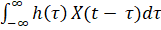<![endif]><![endif]>]<o:p></o:p>

µy = <!--[if gte msEquation 12]><m:oMath><m:nary><m:naryPr><m:limLoc
    m:val="undOvr"/><m:ctrlPr></m:ctrlPr></m:naryPr><m:sub><i
   style='mso-bidi-font-style:normal'><m:r>-&#8734;</m:r></i></m:sub><m:sup><i
   style='mso-bidi-font-style:normal'><m:r>&#8734;</m:r></i></m:sup><m:e><i
   style='mso-bidi-font-style:normal'><m:r>h</m:r></i><m:d><m:dPr><m:ctrlPr></m:ctrlPr></m:dPr><m:e><i
     style='mso-bidi-font-style:normal'><m:r>&#964;</m:r></i></m:e></m:d><i
   style='mso-bidi-font-style:normal'><m:r>.</m:r></i></m:e></m:nary><m:r><m:rPr><m:scr m:val="roman"/><m:sty
    m:val="p"/></m:rPr>E[</m:r><m:r><i style='mso-bidi-font-style:normal'>X</i></m:r><m:r><i
  style='mso-bidi-font-style:normal'>(</i></m:r><m:r><i style='mso-bidi-font-style:
  normal'>t</i></m:r><m:r><i style='mso-bidi-font-style:normal'>-</i></m:r><m:r><i
  style='mso-bidi-font-style:normal'> </i></m:r><m:r><i style='mso-bidi-font-style:
  normal'>&#964;</i></m:r><m:r><i style='mso-bidi-font-style:normal'>)</i></m:r><m:r><i
  style='mso-bidi-font-style:normal'>d&#964;</i></m:r></m:oMath><![endif]--><![if !msEquation]><!--[if gte vml 1]><v:shape
 id="_x0000_i1025" type="#_x0000_t75" style='width:137.25pt;height:22.5pt'>
 <v:imagedata src="Wide_Sense_Stationary_and_Time_Series_files/image003.png"
  o:title="" chromakey="white"/>
</v:shape><![endif]--><![if !vml]>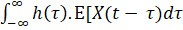<![endif]><![endif]>]<o:p></o:p>

<o:p>&nbsp;</o:p>

Now, if X(t) is WSS, a shift in time
does not affect its mean, i.e.,<o:p></o:p>

E[X(t)] = E[X(t - <!--[if gte msEquation 12]><m:oMath><i
 style='mso-bidi-font-style:normal'><m:r>&#964;</m:r></i></m:oMath><![endif]--><![if !msEquation]><!--[if gte vml 1]><v:shape
 id="_x0000_i1025" type="#_x0000_t75" style='width:6.75pt;height:18pt'>
 <v:imagedata src="Wide_Sense_Stationary_and_Time_Series_files/image005.png"
  o:title="" chromakey="white"/>
</v:shape><![endif]--><![if !vml]><![endif]><![endif]>)]
= µx<o:p></o:p>

E[Y(t)] = <!--[if gte msEquation 12]><m:oMath><m:nary><m:naryPr><m:limLoc
    m:val="undOvr"/><m:ctrlPr></m:ctrlPr></m:naryPr><m:sub><i
   style='mso-bidi-font-style:normal'><m:r>-&#8734;</m:r></i></m:sub><m:sup><i
   style='mso-bidi-font-style:normal'><m:r>&#8734;</m:r></i></m:sup><m:e><i
   style='mso-bidi-font-style:normal'><m:r>h</m:r><m:r>(</m:r><m:r>&#964;</m:r><m:r>)</m:r></i></m:e></m:nary></m:oMath><![endif]--><![if !msEquation]><!--[if gte vml 1]><v:shape
 id="_x0000_i1025" type="#_x0000_t75" style='width:50.25pt;height:22.5pt'>
 <v:imagedata src="Wide_Sense_Stationary_and_Time_Series_files/image007.png"
  o:title="" chromakey="white"/>
</v:shape><![endif]--><![if !vml]>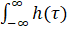<![endif]><![endif]> µx <!--[if gte msEquation 12]><m:oMath><i
 style='mso-bidi-font-style:normal'><m:r>d&#964;</m:r></i></m:oMath><![endif]--><![if !msEquation]><!--[if gte vml 1]><v:shape
 id="_x0000_i1025" type="#_x0000_t75" style='width:15pt;height:18pt'>
 <v:imagedata src="Wide_Sense_Stationary_and_Time_Series_files/image009.png"
  o:title="" chromakey="white"/>
</v:shape><![endif]--><![if !vml]>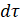<![endif]><![endif]><o:p></o:p>

            = µx
<!--[if gte msEquation 12]><m:oMath><m:nary><m:naryPr><m:limLoc
    m:val="undOvr"/><m:ctrlPr></m:ctrlPr></m:naryPr><m:sub><i
   style='mso-bidi-font-style:normal'><m:r>-&#8734;</m:r></i></m:sub><m:sup><i
   style='mso-bidi-font-style:normal'><m:r>&#8734;</m:r></i></m:sup><m:e><i
   style='mso-bidi-font-style:normal'><m:r>h</m:r><m:r>(</m:r><m:r>&#964;</m:r><m:r>)</m:r></i></m:e></m:nary><i
 style='mso-bidi-font-style:normal'><m:r>d&#964;</m:r></i></m:oMath><![endif]--><![if !msEquation]><!--[if gte vml 1]><v:shape
 id="_x0000_i1025" type="#_x0000_t75" style='width:67.5pt;height:22.5pt'>
 <v:imagedata src="Wide_Sense_Stationary_and_Time_Series_files/image011.png"
  o:title="" chromakey="white"/>
</v:shape><![endif]--><![if !vml]>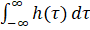<![endif]><![endif]><o:p></o:p>

<o:p>&nbsp;</o:p>

&#8757; <!--[if gte msEquation 12]><m:oMath><m:nary><m:naryPr><m:limLoc
    m:val="undOvr"/><m:ctrlPr></m:ctrlPr></m:naryPr><m:sub><i
   style='mso-bidi-font-style:normal'><m:r>-&#8734;</m:r></i></m:sub><m:sup><i
   style='mso-bidi-font-style:normal'><m:r>&#8734;</m:r></i></m:sup><m:e><i
   style='mso-bidi-font-style:normal'><m:r>h</m:r><m:r>(</m:r><m:r>&#964;</m:r><m:r>)</m:r></i></m:e></m:nary><i
 style='mso-bidi-font-style:normal'><m:r>d&#964;</m:r></i></m:oMath><![endif]--><![if !msEquation]><!--[if gte vml 1]><v:shape
 id="_x0000_i1025" type="#_x0000_t75" style='width:67.5pt;height:22.5pt'>
 <v:imagedata src="Wide_Sense_Stationary_and_Time_Series_files/image011.png"
  o:title="" chromakey="white"/>
</v:shape><![endif]--><![if !vml]><![endif]><![endif]> = H(0)<o:p></o:p>

<o:p>&nbsp;</o:p>

µy = µx . H(0)<o:p></o:p>

<o:p>&nbsp;</o:p>

Since the H(0) will be some constant, we
conclude that the output will also have the same nature as the input
signal.  <o:p></o:p>

So, the output of a wide sense
stationary when the system is LTI is zero mean and WSS signal.<o:p></o:p>

<o:p>&nbsp;</o:p>

<o:p>&nbsp;</o:p>

<b style='mso-bidi-font-weight:normal'>1.
b. When the system is Linear and the input is Gaussian<o:p></o:p></b>

An important property of the Gaussian
random process is that their Probability density function is completely
determined by their mean and covariance, i.e.,<o:p></o:p>

fx(X) = <!--[if gte msEquation 12]><m:oMath><m:f><m:fPr><m:ctrlPr></m:ctrlPr></m:fPr><m:num><i
   style='mso-bidi-font-style:normal'><m:r>1</m:r></i></m:num><m:den><m:rad><m:radPr><m:degHide
      m:val="on"/><m:ctrlPr></m:ctrlPr></m:radPr><m:deg></m:deg><m:e><i
     style='mso-bidi-font-style:normal'><m:r>2</m:r><m:r>&#960;</m:r></i><m:sSup><m:sSupPr><m:ctrlPr></m:ctrlPr></m:sSupPr><m:e><i
       style='mso-bidi-font-style:normal'><m:r>&#963;</m:r></i></m:e><m:sup><i
       style='mso-bidi-font-style:normal'><m:r>2</m:r></i></m:sup></m:sSup></m:e></m:rad></m:den></m:f></m:oMath><![endif]--><![if !msEquation]><!--[if gte vml 1]><v:shape id="_x0000_i1025" type="#_x0000_t75"
 style='width:31.5pt;height:25.5pt'>
 <v:imagedata src="Wide_Sense_Stationary_and_Time_Series_files/image013.png"
  o:title="" chromakey="white"/>
</v:shape><![endif]--><![if !vml]>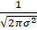<![endif]><![endif]> exp(<!--[if gte msEquation 12]><m:oMath><i
 style='mso-bidi-font-style:normal'><m:r>-</m:r></i><m:f><m:fPr><m:ctrlPr></m:ctrlPr></m:fPr><m:num><i style='mso-bidi-font-style:
   normal'><m:r>(</m:r><m:r>x</m:r><m:r>-</m:r><m:r>
    </m:r><m:r>&#956;</m:r></i><m:sSup><m:sSupPr><m:ctrlPr></m:ctrlPr></m:sSupPr><m:e><i
     style='mso-bidi-font-style:normal'><m:r>)</m:r></i></m:e><m:sup><i
     style='mso-bidi-font-style:normal'><m:r>2</m:r></i></m:sup></m:sSup></m:num><m:den><m:sSup><m:sSupPr><m:ctrlPr></m:ctrlPr></m:sSupPr><m:e><i
     style='mso-bidi-font-style:normal'><m:r>2</m:r><m:r>&#963;</m:r></i></m:e><m:sup><i
     style='mso-bidi-font-style:normal'><m:r>2</m:r></i></m:sup></m:sSup></m:den></m:f><i
 style='mso-bidi-font-style:normal'><m:r> </m:r></i></m:oMath><![endif]--><![if !msEquation]><!--[if gte vml 1]><v:shape
 id="_x0000_i1025" type="#_x0000_t75" style='width:51.75pt;height:27pt'>
 <v:imagedata src="Wide_Sense_Stationary_and_Time_Series_files/image015.png"
  o:title="" chromakey="white"/>
</v:shape><![endif]--><![if !vml]>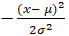<![endif]><![endif]>)<o:p></o:p>

Where <!--[if gte msEquation 12]><m:oMath><i
 style='mso-bidi-font-style:normal'><m:r>&#956;</m:r></i></m:oMath><![endif]--><![if !msEquation]><!--[if gte vml 1]><v:shape
 id="_x0000_i1025" type="#_x0000_t75" style='width:8.25pt;height:18pt'>
 <v:imagedata src="Wide_Sense_Stationary_and_Time_Series_files/image017.png"
  o:title="" chromakey="white"/>
</v:shape><![endif]--><![if !vml]><![endif]><![endif]> is mean<o:p></o:p>

And &#963; is standard deviation<o:p></o:p>

<o:p>&nbsp;</o:p>

The Fourier analysis states that any
Linear system in the frequency spectrum can be represented as the sum of
sinusoids, i.e., <o:p></o:p>

H(&#969;) = <!--[if gte msEquation 12]><m:oMath><m:nary><m:naryPr><m:chr
    m:val="&#8721;"/><m:limLoc m:val="undOvr"/><m:ctrlPr></m:ctrlPr></m:naryPr><m:sub><i style='mso-bidi-font-style:
   normal'><m:r>n</m:r></i><m:r><m:rPr><m:scr m:val="roman"/><m:sty
      m:val="p"/></m:rPr>&#8594; </m:r><m:r><i style='mso-bidi-font-style:normal'>-&#8734;</i></m:r></m:sub><m:sup><m:r><m:rPr><m:scr m:val="roman"/><m:sty
      m:val="p"/></m:rPr>n&#8594; </m:r><m:r><i style='mso-bidi-font-style:
    normal'>&#8734;</i></m:r></m:sup><m:e><m:r><m:rPr><m:scr m:val="roman"/><m:sty
      m:val="p"/></m:rPr>sin&#8289;</m:r><m:r><i style='mso-bidi-font-style:
    normal'>(</i></m:r><m:r><i style='mso-bidi-font-style:normal'>n</i></m:r></m:e></m:nary></m:oMath><![endif]--><![if !msEquation]><!--[if gte vml 1]><v:shape
 id="_x0000_i1025" type="#_x0000_t75" style='width:81pt;height:18pt'>
 <v:imagedata src="Wide_Sense_Stationary_and_Time_Series_files/image019.png"
  o:title="" chromakey="white"/>
</v:shape><![endif]--><![if !vml]>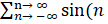<![endif]><![endif]>&#969;0)<o:p></o:p>

Now, if the input X(t) is Gaussian, then
the output y(t) in the frequency spectrum will be :<o:p></o:p>

Y(&#969;) = X(&#969;).H(&#969;)<o:p></o:p>

<o:p>&nbsp;</o:p>

For a sinusoid input, the output will be
varied in Magnitude and phase, but nature will remain the same according to the
input.<o:p></o:p>

<o:p>&nbsp;</o:p>

So, the output will be Gaussian.<o:p></o:p>

<o:p>&nbsp;</o:p>

The output phase and magnitude will be
varied, but nature will remain the same as that of the input. So, if the input
is Gaussian, the output will also be Gaussian.<o:p></o:p>

<o:p>&nbsp;</o:p>

<o:p>&nbsp;</o:p>

<b style='mso-bidi-font-weight:normal'>1.
c. Time Series Analysis - AR, MA, and ARMA Models<o:p></o:p></b>

<b style='mso-bidi-font-weight:normal'><o:p>&nbsp;</o:p></b>

<b style='mso-bidi-font-weight:normal'>Wold
Representation Theorem<o:p></o:p></b>

Any zero-mean covariance stationary time
series {Xt}can be decomposed as <o:p></o:p>

Xt = Vt  +  St<o:p></o:p>

Where { Vt } is a linearly
deterministic process, i.e., a linear combination of past values of  Vt with constant coefficients. It
is analogical to autoregressive (AR) model.<o:p></o:p>

St = <!--[if gte msEquation 12]><m:oMath><m:nary><m:naryPr><m:chr
    m:val="&#8721;"/><m:limLoc m:val="undOvr"/><m:ctrlPr></m:ctrlPr></m:naryPr><m:sub><i style='mso-bidi-font-style:
   normal'><m:r>i</m:r><m:r>=0</m:r></i></m:sub><m:sup><i
   style='mso-bidi-font-style:normal'><m:r>&#8734;</m:r></i></m:sup><m:e><m:r><m:rPr><m:scr m:val="roman"/><m:sty
      m:val="p"/></m:rPr>&#952;</m:r></m:e></m:nary></m:oMath><![endif]--><![if !msEquation]><!--[if gte vml 1]><v:shape
 id="_x0000_i1025" type="#_x0000_t75" style='width:36.75pt;height:18pt'>
 <v:imagedata src="Wide_Sense_Stationary_and_Time_Series_files/image021.png"
  o:title="" chromakey="white"/>
</v:shape><![endif]--><![if !vml]>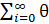<![endif]><![endif]>i
&#42794;t-i  is an infinite
moving average process of error terms, where<o:p></o:p>

&#952;0 = 1<o:p></o:p>

<!--[if gte msEquation 12]><m:oMath><m:nary><m:naryPr><m:chr
    m:val="&#8721;"/><m:limLoc m:val="undOvr"/><m:ctrlPr></m:ctrlPr></m:naryPr><m:sub><i style='mso-bidi-font-style:
   normal'><m:r>i</m:r><m:r>=0</m:r></i></m:sub><m:sup><i
   style='mso-bidi-font-style:normal'><m:r>&#8734;</m:r></i></m:sup><m:e><m:r><m:rPr><m:scr m:val="roman"/><m:sty
      m:val="p"/></m:rPr>(&#952;</m:r></m:e></m:nary></m:oMath><![endif]--><![if !msEquation]><!--[if gte vml 1]><v:shape
 id="_x0000_i1025" type="#_x0000_t75" style='width:40.5pt;height:18pt'>
 <v:imagedata src="Wide_Sense_Stationary_and_Time_Series_files/image023.png"
  o:title="" chromakey="white"/>
</v:shape><![endif]--><![if !vml]>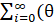<![endif]><![endif]>i
)2  &lt; 
&#8734;<o:p></o:p>

&#42794;t is linearly
unpredictable white noise, i.e., <o:p></o:p>

E(&#42794;t) = 0,  E(&#42794;t2) = &#963;2,
 E(&#42794;t &#42794;s)
= 0  &#8704;t,  &#8704;s &#8800; t<o:p></o:p>

And &#42794;t
is uncorrelated with Vt<o:p></o:p>

E(&#42794;t ­Vs) =
0  &#8704;t, s<o:p></o:p>

<o:p>&nbsp;</o:p>

The output of a linear system characterized
by a rational system function of the form<o:p></o:p>

<!--[if gte vml 1]><v:shape
 id="Picture_x0020_1" o:spid="_x0000_i1028" type="#_x0000_t75" style='width:248.25pt;
 height:97.5pt;visibility:visible;mso-wrap-style:square'>
 <v:imagedata src="Wide_Sense_Stationary_and_Time_Series_files/image025.png"
  o:title=""/>
</v:shape><![endif]--><![if !vml]>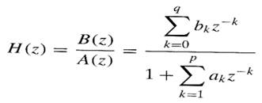<![endif]>    … (i)<o:p></o:p>

The
corresponding difference equation is<o:p></o:p>

<!--[if gte vml 1]><v:shape
 id="Picture_x0020_2" o:spid="_x0000_i1027" type="#_x0000_t75" style='width:371.25pt;
 height:52.5pt;visibility:visible;mso-wrap-style:square'>
 <v:imagedata src="Wide_Sense_Stationary_and_Time_Series_files/image027.png"
  o:title=""/>
</v:shape><![endif]--><![if !vml]>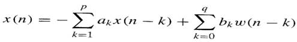<![endif]>….
(ii)<o:p></o:p>

<o:p>&nbsp;</o:p>

Where
w[n] is the input sequence to the system and the observation data, x[n], represents
the output sequence.<o:p></o:p>

In
power spectrum estimation, the input sequence is not observable. However, if
the observed data are characterized as a stationary random process, then the
input sequence is also assumed to be a stationary random process. In such a
case the power density spectrum of the data is <o:p></o:p>

<!--[if gte vml 1]><v:shape
 id="Picture_x0020_3" o:spid="_x0000_i1026" type="#_x0000_t75" style='width:231pt;
 height:26.25pt;visibility:visible;mso-wrap-style:square'>
 <v:imagedata src="Wide_Sense_Stationary_and_Time_Series_files/image029.png"
  o:title=""/>
</v:shape><![endif]--><![if !vml]>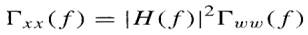<![endif]>   … (iii)<o:p></o:p>

Where
&#915;ww(f) is the power density spectrum of the input sequence and
H(f) is the frequency response of the model.<o:p></o:p>

Since
our objective is to estimate the power density spectrum &#915;xx(f),
it is convenient to assume that the input sequence w[n] is a zero mean white
noise sequence with autocorrelation. <o:p></o:p>

&#915;ww(m)
= &#963;2w &#948;(m)   
… (iv)<o:p></o:p>

<o:p>&nbsp;</o:p>

<o:p>&nbsp;</o:p>

Where
&#963;2w  is
variance (i.e., &#963;2w = |w(n)|2). Then the
power density spectrum of the observed data is simply<o:p></o:p>

<!--[if gte vml 1]><v:shape
 id="Picture_x0020_4" o:spid="_x0000_i1025" type="#_x0000_t75" style='width:317.25pt;
 height:38.25pt;visibility:visible;mso-wrap-style:square'>
 <v:imagedata src="Wide_Sense_Stationary_and_Time_Series_files/image031.png"
  o:title=""/>
</v:shape><![endif]--><![if !vml]>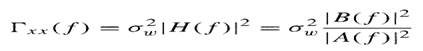<![endif]>   … (v)<o:p></o:p>

In
the model-based approach the spectrum estimation procedure consists of two
steps. Given data sequence x[n], 0 &#8804; n &#8804; N-1, we estimate the
parameters {ak} and {bk} of the model. Then from this
estimates, we compute the power spectrum estimate according to equation (v)<o:p></o:p>

<o:p>&nbsp;</o:p>

Random
process x[n] generated by pole-zero model as shown in equation (i) is called an
autoregressive moving average (ARMA) process of order (p,q) and it is usually
denoted as ARMA (p,q). If q = 0 and b0 = 1, the resulting system
model has a system function H(z) = 1 / A(z) and its output x[n] is called an
autoregressive (AR) process of order p. This is denoted as AR(p). The third
possible model is obtained by setting obtained by setting A(z) = 1, so that H(z)
= B(z). Its output x[n] is called a moving average (MA) process of order q and
denoted as MA(q). <o:p></o:p>

Of
these three linear models the AR model is by far the most widely used. The
reasons are twofold. First, the AR model is suitable for representing spectra
with narrow peaks (resonances). Second, the AR model results in very simple
linear equations for the AR parameters. On the other hand, the MA model, as a
general rule, requires many more coefficients to represent a narrow spectrum. Consequently,
it is rarely used by itself as a model for spectrum estimation. By combining
poles and zeros, the ARMA model provides a more efficient representation from
the viewpoint of the number of model parameters, of the spectrum of a random
process. The decomposition theorem due to Wold representation asserts that any
ARMA or MA process can be represented uniquely by an AR model of possibly
infinite order. In view of this theorem, the issue of model selection reduces
to selecting the model that requires the smallest number of model parameters
that are easy to compute. Usually the choice in practice is the AR model. <o:p></o:p>

<o:p>&nbsp;</o:p>

<o:p>&nbsp;</o:p>

<b style='mso-bidi-font-weight:
normal'><o:p>&nbsp;</o:p></b>

<b style='mso-bidi-font-weight:
normal'>Autoregressive (AR) Model<o:p></o:p></b>

The
notation AR(p) indicates an autoregressive model of order p. The AR(p) model is
defined as <o:p></o:p>

Xt
= <!--[if gte msEquation 12]><m:oMath><m:nary><m:naryPr><m:chr m:val="&#8721;"/><m:limLoc
    m:val="undOvr"/><m:ctrlPr></m:ctrlPr></m:naryPr><m:sub><i
   style='mso-bidi-font-style:normal'><m:r>i</m:r><m:r>=1</m:r></i></m:sub><m:sup><i
   style='mso-bidi-font-style:normal'><m:r>p</m:r></i></m:sup><m:e><i style='mso-bidi-font-style:
   normal'><m:r>&#966;</m:r></i></m:e></m:nary></m:oMath><![endif]--><![if !msEquation]><!--[if gte vml 1]><v:shape
 id="_x0000_i1025" type="#_x0000_t75" style='width:39pt;height:19.5pt'>
 <v:imagedata src="Wide_Sense_Stationary_and_Time_Series_files/image033.png"
  o:title="" chromakey="white"/>
</v:shape><![endif]--><![if !vml]>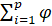<![endif]><![endif]>i
Xt-i 
+ &#42794;t<o:p></o:p>

Where
&#966;1, …, &#966;p are parameters of the model, and
&#42794;t is white noise. This can be equivalently written using the
backshift operator B as <o:p></o:p>

Xt
= <!--[if gte msEquation 12]><m:oMath><m:nary><m:naryPr><m:chr m:val="&#8721;"/><m:limLoc
    m:val="undOvr"/><m:ctrlPr></m:ctrlPr></m:naryPr><m:sub><i
   style='mso-bidi-font-style:normal'><m:r>i</m:r><m:r>=1</m:r></i></m:sub><m:sup><i
   style='mso-bidi-font-style:normal'><m:r>p</m:r></i></m:sup><m:e><i style='mso-bidi-font-style:
   normal'><m:r>&#966;</m:r></i></m:e></m:nary></m:oMath><![endif]--><![if !msEquation]><!--[if gte vml 1]><v:shape
 id="_x0000_i1025" type="#_x0000_t75" style='width:39pt;height:19.5pt'>
 <v:imagedata src="Wide_Sense_Stationary_and_Time_Series_files/image033.png"
  o:title="" chromakey="white"/>
</v:shape><![endif]--><![if !vml]><![endif]><![endif]>i
Bi Xt  + &#42794;t<o:p></o:p>

<o:p>&nbsp;</o:p>

so
that, moving the summation term to the left side and using polynomial notation,
we have<o:p></o:p>

&#981;[B]
Xt  = &#42794;t<o:p></o:p>

<o:p>&nbsp;</o:p>

An
autoregressive model is simply a linear regression of the current value of the
series against one or more prior values of the series. The value of p is called
the order of the AR model. AR models can be analyzed with one of various
methods; including standard linear least squares techniques. They also have a
straightforward interpretation. <o:p></o:p>

<o:p>&nbsp;</o:p>

An
autoregressive model can thus be viewed as the output of an all-pole infinite
impulse response filter whose input is white noise. <o:p></o:p>

Some
parameter constraints are necessary for the model to remain weak-sense
stationary. For example, processes in the AR(1) model with |&#966;1|
&#8805; 1 are not stationary. More generally, for an AR(p) model to be
weak-sense stationary, the roots of the polynomial &#934;(z) : = 1 - <!--[if gte msEquation 12]><m:oMath><m:nary><m:naryPr><m:chr
    m:val="&#8721;"/><m:limLoc m:val="undOvr"/><m:ctrlPr></m:ctrlPr></m:naryPr><m:sub><i style='mso-bidi-font-style:
   normal'><m:r>i</m:r><m:r>=1</m:r></i></m:sub><m:sup><i
   style='mso-bidi-font-style:normal'><m:r>p</m:r></i></m:sup><m:e><i style='mso-bidi-font-style:
   normal'><m:r>&#966;</m:r></i></m:e></m:nary></m:oMath><![endif]--><![if !msEquation]><!--[if gte vml 1]><v:shape
 id="_x0000_i1025" type="#_x0000_t75" style='width:39pt;height:19.5pt'>
 <v:imagedata src="Wide_Sense_Stationary_and_Time_Series_files/image033.png"
  o:title="" chromakey="white"/>
</v:shape><![endif]--><![if !vml]><![endif]><![endif]>i
zi   must lie outside the unit
circle i.e., each (complex) root zi must satisfy  | zi | &gt; 1<o:p></o:p>

<o:p>&nbsp;</o:p>

<o:p>&nbsp;</o:p>

<b style='mso-bidi-font-weight:
normal'>Moving-average (MA) model<o:p></o:p></b>

The
notation MA(q) refers to the moving average model of order q:<o:p></o:p>

Xt
= µ + &#42794;t + &#952;1&#42794;t-1 + … + &#952;q&#42794;t-q   = 
µ + <!--[if gte msEquation 12]><m:oMath><m:nary><m:naryPr><m:chr
    m:val="&#8721;"/><m:limLoc m:val="undOvr"/><m:ctrlPr></m:ctrlPr></m:naryPr><m:sub><i style='mso-bidi-font-style:
   normal'><m:r>i</m:r><m:r>=1</m:r></i></m:sub><m:sup><i
   style='mso-bidi-font-style:normal'><m:r>q</m:r></i></m:sup><m:e><m:r><m:rPr><m:scr m:val="roman"/><m:sty
      m:val="p"/></m:rPr>&#952;</m:r></m:e></m:nary></m:oMath><![endif]--><![if !msEquation]><!--[if gte vml 1]><v:shape
 id="_x0000_i1025" type="#_x0000_t75" style='width:36.75pt;height:19.5pt'>
 <v:imagedata src="Wide_Sense_Stationary_and_Time_Series_files/image035.png"
  o:title="" chromakey="white"/>
</v:shape><![endif]--><![if !vml]>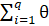<![endif]><![endif]>i
&#42794;t-i + &#42794;t<o:p></o:p>

<o:p>&nbsp;</o:p>

Where
µ is the mean of the series, the &#952;1, &#952;2, …,
&#952;q are parameters of the model and the &#42794;t,
&#42794;t-1, …, &#42794;t-q  are white noise error terms. The value of q is
called the order of the MA model. This can be equivalently written in terms of
the backshift operator B as<o:p></o:p>

Xt
= µ + (1 + &#952;1B + … + &#952;qBq)&#42794;t   <o:p></o:p>

<o:p>&nbsp;</o:p>

Thus
a moving-average model is conceptually a linear regression of the current value
of series against current and previous (observed) white noise error terms or
random shocks. The random shocks at each point are assumed to be mutually
independent and to come from the same distribution, typically a normal
distribution, with location at zero and constant scale. <o:p></o:p>

<o:p>&nbsp;</o:p>

<o:p>&nbsp;</o:p>

<b style='mso-bidi-font-weight:
normal'>Autoregressive-moving-average (ARMA) Model<o:p></o:p></b>

In
the statistical analysis of time series, autoregressive-moving-average (ARMA)
models provide a parsimonious description of a (weakly) stationary stochastic
process in terms of two polynomials, one for autoregression (AR) and the second
for moving-average (MA). <o:p></o:p>

For
a given time series of data Xt, the ARMA model is a tool for
understanding and, perhaps, predicting future values in this series. The AR
part involves regressing the variable on its own lagged (i.e., past) values.
The MA part involves modeling the error term as a linear combination of error
terms occurring contemporaneously and at various times in the past. <o:p></o:p>

The
model is usually referred to as the ARMA(p,q) model where p is the order of the
AR part and q is the order of the MA part.<o:p></o:p>

<o:p>&nbsp;</o:p>

The
notation ARMA(p, q) refers to the model with p autoregressive terms and q
moving-average terms. This model contains the AR(p) and MA(q) models,<o:p></o:p>

Xt
= &#42794;t  +  <!--[if gte msEquation 12]><m:oMath><m:nary><m:naryPr><m:chr
    m:val="&#8721;"/><m:limLoc m:val="undOvr"/><m:ctrlPr></m:ctrlPr></m:naryPr><m:sub><i style='mso-bidi-font-style:
   normal'><m:r>i</m:r><m:r>=1</m:r></i></m:sub><m:sup><i
   style='mso-bidi-font-style:normal'><m:r>p</m:r></i></m:sup><m:e><i style='mso-bidi-font-style:
   normal'><m:r>&#966;</m:r></i></m:e></m:nary></m:oMath><![endif]--><![if !msEquation]><!--[if gte vml 1]><v:shape
 id="_x0000_i1025" type="#_x0000_t75" style='width:39pt;height:19.5pt'>
 <v:imagedata src="Wide_Sense_Stationary_and_Time_Series_files/image033.png"
  o:title="" chromakey="white"/>
</v:shape><![endif]--><![if !vml]><![endif]><![endif]>i
Xt-i 
 +  <!--[if gte msEquation 12]><m:oMath><m:nary><m:naryPr><m:chr
    m:val="&#8721;"/><m:limLoc m:val="undOvr"/><m:ctrlPr></m:ctrlPr></m:naryPr><m:sub><i style='mso-bidi-font-style:
   normal'><m:r>i</m:r><m:r>=1</m:r></i></m:sub><m:sup><i
   style='mso-bidi-font-style:normal'><m:r>q</m:r></i></m:sup><m:e><m:r><m:rPr><m:scr m:val="roman"/><m:sty
      m:val="p"/></m:rPr>&#952;</m:r></m:e></m:nary></m:oMath><![endif]--><![if !msEquation]><!--[if gte vml 1]><v:shape
 id="_x0000_i1025" type="#_x0000_t75" style='width:36.75pt;height:19.5pt'>
 <v:imagedata src="Wide_Sense_Stationary_and_Time_Series_files/image035.png"
  o:title="" chromakey="white"/>
</v:shape><![endif]--><![if !vml]><![endif]><![endif]>i
&#42794;t-i<o:p></o:p>

<o:p>&nbsp;</o:p>

This
method was useful for low-order polynomials (of degree three or less). The ARMA
model is essentially an infinite impulse response filter applied to white
noise.<o:p></o:p>

<o:p>&nbsp;</o:p>

<o:p>&nbsp;</o:p>

<b style='mso-bidi-font-weight:
normal'>Specifications in terms of lag operator <o:p></o:p></b>

The
model can be specified in terms of the lag operator L. In these terms then the
AR(p) model is given by<o:p></o:p>

&#42794;t
 = 
(<!--[if gte msEquation 12]><m:oMath><i style='mso-bidi-font-style:
 normal'><m:r>1- </m:r></i><m:nary><m:naryPr><m:chr
    m:val="&#8721;"/><m:limLoc m:val="undOvr"/><m:ctrlPr></m:ctrlPr></m:naryPr><m:sub><i style='mso-bidi-font-style:
   normal'><m:r>i</m:r><m:r>=1</m:r></i></m:sub><m:sup><i
   style='mso-bidi-font-style:normal'><m:r>p</m:r></i></m:sup><m:e><i style='mso-bidi-font-style:
   normal'><m:r>&#966;</m:r></i></m:e></m:nary></m:oMath><![endif]--><![if !msEquation]><!--[if gte vml 1]><v:shape
 id="_x0000_i1025" type="#_x0000_t75" style='width:66.75pt;height:19.5pt'>
 <v:imagedata src="Wide_Sense_Stationary_and_Time_Series_files/image037.png"
  o:title="" chromakey="white"/>
</v:shape><![endif]--><![if !vml]>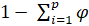<![endif]><![endif]>i
Li ) Xt = &#966;(L)
Xt<o:p></o:p>

<o:p>&nbsp;</o:p>

Where
&#966; represents the polynomial<o:p></o:p>

&#966;(L)
= <!--[if gte msEquation 12]><m:oMath><i style='mso-bidi-font-style:
 normal'><m:r>1- </m:r></i><m:nary><m:naryPr><m:chr
    m:val="&#8721;"/><m:limLoc m:val="undOvr"/><m:ctrlPr></m:ctrlPr></m:naryPr><m:sub><i style='mso-bidi-font-style:
   normal'><m:r>i</m:r><m:r>=1</m:r></i></m:sub><m:sup><i
   style='mso-bidi-font-style:normal'><m:r>p</m:r></i></m:sup><m:e><i style='mso-bidi-font-style:
   normal'><m:r>&#966;</m:r></i></m:e></m:nary></m:oMath><![endif]--><![if !msEquation]><!--[if gte vml 1]><v:shape
 id="_x0000_i1025" type="#_x0000_t75" style='width:66.75pt;height:19.5pt'>
 <v:imagedata src="Wide_Sense_Stationary_and_Time_Series_files/image037.png"
  o:title="" chromakey="white"/>
</v:shape><![endif]--><![if !vml]><![endif]><![endif]>i
Li <o:p></o:p>

<o:p>&nbsp;</o:p>

The
MA(q) model is given by<o:p></o:p>

Xt  =  (
1  + 
 <!--[if gte msEquation 12]><m:oMath><m:nary><m:naryPr><m:chr
    m:val="&#8721;"/><m:limLoc m:val="undOvr"/><m:ctrlPr></m:ctrlPr></m:naryPr><m:sub><i style='mso-bidi-font-style:
   normal'><m:r>i</m:r><m:r>=1</m:r></i></m:sub><m:sup><i
   style='mso-bidi-font-style:normal'><m:r>q</m:r></i></m:sup><m:e><m:r><m:rPr><m:scr m:val="roman"/><m:sty
      m:val="p"/></m:rPr>&#952;</m:r></m:e></m:nary></m:oMath><![endif]--><![if !msEquation]><!--[if gte vml 1]><v:shape
 id="_x0000_i1025" type="#_x0000_t75" style='width:36.75pt;height:19.5pt'>
 <v:imagedata src="Wide_Sense_Stationary_and_Time_Series_files/image035.png"
  o:title="" chromakey="white"/>
</v:shape><![endif]--><![if !vml]><![endif]><![endif]>i
Li  ) &#42794;t
 = 
&#952;(L) &#42794;t,<o:p></o:p>

<o:p>&nbsp;</o:p>

Where
&#952; represents the polynomial<o:p></o:p>

&#952;(L)
= 1  + 
<!--[if gte msEquation 12]><m:oMath><m:nary><m:naryPr><m:chr
    m:val="&#8721;"/><m:limLoc m:val="undOvr"/><m:ctrlPr></m:ctrlPr></m:naryPr><m:sub><i style='mso-bidi-font-style:
   normal'><m:r>i</m:r><m:r>=1</m:r></i></m:sub><m:sup><i
   style='mso-bidi-font-style:normal'><m:r>q</m:r></i></m:sup><m:e><m:r><m:rPr><m:scr m:val="roman"/><m:sty
      m:val="p"/></m:rPr>&#952;</m:r></m:e></m:nary></m:oMath><![endif]--><![if !msEquation]><!--[if gte vml 1]><v:shape
 id="_x0000_i1025" type="#_x0000_t75" style='width:36.75pt;height:19.5pt'>
 <v:imagedata src="Wide_Sense_Stationary_and_Time_Series_files/image035.png"
  o:title="" chromakey="white"/>
</v:shape><![endif]--><![if !vml]><![endif]><![endif]>i
Li  <o:p></o:p>

<o:p>&nbsp;</o:p>

Finally,
the combined ARMA(p,q) model is given by<o:p></o:p>

 (<!--[if gte msEquation 12]><m:oMath><i
 style='mso-bidi-font-style:normal'><m:r>1- </m:r></i><m:nary><m:naryPr><m:chr m:val="&#8721;"/><m:limLoc
    m:val="undOvr"/><m:ctrlPr></m:ctrlPr></m:naryPr><m:sub><i
   style='mso-bidi-font-style:normal'><m:r>i</m:r><m:r>=1</m:r></i></m:sub><m:sup><i
   style='mso-bidi-font-style:normal'><m:r>p</m:r></i></m:sup><m:e><i style='mso-bidi-font-style:
   normal'><m:r>&#966;</m:r></i></m:e></m:nary></m:oMath><![endif]--><![if !msEquation]><!--[if gte vml 1]><v:shape
 id="_x0000_i1025" type="#_x0000_t75" style='width:66.75pt;height:19.5pt'>
 <v:imagedata src="Wide_Sense_Stationary_and_Time_Series_files/image037.png"
  o:title="" chromakey="white"/>
</v:shape><![endif]--><![if !vml]><![endif]><![endif]>i
Li ) Xt   =   (
1  +  
<!--[if gte msEquation 12]><m:oMath><m:nary><m:naryPr><m:chr
    m:val="&#8721;"/><m:limLoc m:val="undOvr"/><m:ctrlPr></m:ctrlPr></m:naryPr><m:sub><i style='mso-bidi-font-style:
   normal'><m:r>i</m:r><m:r>=1</m:r></i></m:sub><m:sup><i
   style='mso-bidi-font-style:normal'><m:r>q</m:r></i></m:sup><m:e><m:r><m:rPr><m:scr m:val="roman"/><m:sty
      m:val="p"/></m:rPr>&#952;</m:r></m:e></m:nary></m:oMath><![endif]--><![if !msEquation]><!--[if gte vml 1]><v:shape
 id="_x0000_i1025" type="#_x0000_t75" style='width:36.75pt;height:19.5pt'>
 <v:imagedata src="Wide_Sense_Stationary_and_Time_Series_files/image035.png"
  o:title="" chromakey="white"/>
</v:shape><![endif]--><![if !vml]><![endif]><![endif]>i
Li  ) &#42794;t<o:p></o:p>

<o:p>&nbsp;</o:p>

Or,
more concisely,<o:p></o:p>

&#966;(L)Xt   =  
&#952;(L) &#42794;t<o:p></o:p>

<o:p>&nbsp;</o:p>

or,
<o:p></o:p>

<!--[if gte msEquation 12]><m:oMath><m:f><m:fPr><m:ctrlPr></m:ctrlPr></m:fPr><m:num><m:r><m:rPr><m:scr m:val="roman"/><m:sty
      m:val="p"/></m:rPr>&#966;</m:r><m:d><m:dPr><m:ctrlPr></m:ctrlPr></m:dPr><m:e><m:r><m:rPr><m:scr m:val="roman"/><m:sty
        m:val="p"/></m:rPr>L</m:r></m:e></m:d><m:ctrlPr></m:ctrlPr></m:num><m:den><m:r><m:rPr><m:scr m:val="roman"/><m:sty
      m:val="p"/></m:rPr>&#952;</m:r><m:d><m:dPr><m:ctrlPr></m:ctrlPr></m:dPr><m:e><m:r><m:rPr><m:scr m:val="roman"/><m:sty
        m:val="p"/></m:rPr>L</m:r></m:e></m:d></m:den></m:f></m:oMath><![endif]--><![if !msEquation]><!--[if gte vml 1]><v:shape id="_x0000_i1025" type="#_x0000_t75"
 style='width:21.75pt;height:27.75pt'>
 <v:imagedata src="Wide_Sense_Stationary_and_Time_Series_files/image039.png"
  o:title="" chromakey="white"/>
</v:shape><![endif]--><![if !vml]>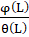<![endif]><![endif]> Xt 
=  &#42794;t<o:p></o:p>

<o:p>&nbsp;</o:p>

<o:p>&nbsp;</o:p>

<b style='mso-bidi-font-weight:
normal'>Applications<o:p></o:p></b>

The time-series models are used to analyze and
predict the data. A linear time series is modeled by linear difference
equations involving the time series and the white noise or the innovation
process. Such ARMA(p, q) models can be analyzed using the linear system theory.<o:p></o:p>

Moreover,
it is used for weather forecasting, climate forecasting, economic forecasting,
healthcare forecasting engineering forecasting, finance forecasting, retail
forecasting, business forecasting, environmental studies forecasting, social
studies forecasting, and more.<o:p></o:p>

</body>

</html>
